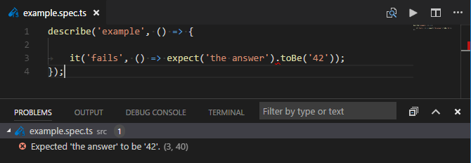

# Mocha Problem Matcher

A problem matcher to show [Mocha](https://mochajs.org) spec errors when running tests in the terminal.

Note, this uses the TAP protocol reporter.

## Preview



## Usage

You can enable this problem matcher by using its name "$mocha".

The following example shows how to add problem matchers to your project:

```json
{
	"version": "2.0.0",
	"type": "shell",
	"tasks": [
		{
			"taskName": "test",
			"command": "mocha",
			"group": "test",
			"args": [
				"--reporter", "tap",
				"--colors",
				"test/**/*spec.js" // or "${file}"
			],
			"problemMatcher": "$mocha"
		}
	]
}
```
